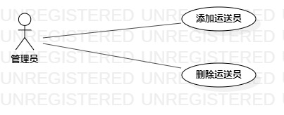

## 实验二：用例建模

## 实验目标
学习用例建模，画出用例图

## 实验内容
- 1.细化功能需求。
- 2.画出用例图（Use Case Diagram）。
- 3.编写用例规约（表格）。
## 实验步骤
- 1.写出功能需求。
- 2.画出用例图
## 实验结果

 图1.物流订单系统的用例图 
## 表1：登录用例规约  

用例编号  | UC01 | 备注  
-|:-|-  
用例名称  | 登录  |   
前置条件  |      |    
后置条件  | 管理员进入系统首页     |   
基本流程  | 1. 管理员点击登录按钮；  |   
~| 2. 系统显示登录页面；  |   
~| 3. 管理员输入账户名和密码，点击登录按钮；  |   
~| 4. 系统**查询到**账户信息，检查账户名与密码**相匹配**，记录用户登录状态；  |   
~| 5. 系统显示订单首页。  |  
扩展流程  | 4.1 系统检查发现账户不存在，**提示“账户不存在”**；  |  
~| 4.2 系统检查发现账户名与密码不匹配，**提示“密码不正确”**。  |  

## 表2：添加订单用例规约 

用例编号  | UC02 | 备注  
-|:-|-  
用例名称  | 添加订单  |   
前置条件  |管理员已登录进入系统|    
后置条件  | 添加订单信息 |   
基本流程  | 1. 管理员在系统首页点击添加订单按钮；  |   
~| 2. 系统显示订单添加页面；  |   
~| 3. 管理员输入订单信息，点击添加按钮；  |   
~| 4. 系统添加订单信息；  |   
~| 5. 系统显示订单信息页面。  |  
扩展流程  |   |  
~|  |  

## 表3：删除订单用例规约 

用例编号  | UC03 | 备注  
-|:-|-  
用例名称  | 删除订单信息  |   
前置条件  |管理员进入订单信息页面|    
后置条件  | 删除订单信息 |   
基本流程  | 1. 管理员在订单信息页面点击删除订单按钮；  |   
~| 2. 系统提示"是否要删除此订单？"；  |   
~| 3. 管理员点击"是"按钮；  |   
~| 4. 系统删除订单信息；  |   
~| 5. 系统显示订单信息页面。  |  
扩展流程  | 2.1 管理员点击"否"按钮，**提示消失** |  
~|  |  

## 表4：添加运送员用例规约 

用例编号  | UC04 | 备注  
-|:-|-  
用例名称  | 添加运送员信息  |   
前置条件  |管理员进入运送员信息页面|    
后置条件  | 添加运送员信息 |   
基本流程  | 1. 管理员在运送员信息页面点击添加运送员按钮；  |   
~| 2. 系统显示运送员添加页面；  |   
~| 3. 管理员输入运送员信息，点击添加按钮；  |   
~| 4. 系统添加运送员信息；  |   
~| 5. 系统显示运送员信息页面。  |  
扩展流程  |   |  
~|  |  

## 表5：删除运送员用例规约 

用例编号  | UC05 | 备注  
-|:-|-  
用例名称  | 删除运送员信息  |   
前置条件  |管理员进入运送员信息页面|    
后置条件  | 删除运送员信息 |   
基本流程  | 1. 管理员在运送员信息页面点击删除运送员按钮；  |   
~| 2. 系统提示"是否要删除此运送员？"；  |   
~| 3. 管理员点击"是"按钮；  |   
~| 4. 系统删除运送员信息；  |   
~| 5. 系统显示运送员信息页面。  |  
扩展流程  | 2.1 管理员点击"否"按钮，**提示消失** |  
~|  |  
