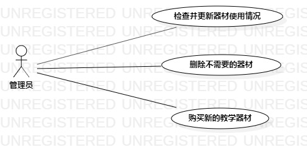

# 实验二

## 实验目标
1.细化选题
2.使用Markdown撰编写报告
3.使用StarUML用例建模

## 实验内容
1.创建用例图
2.编写实验报告文档
3.编写用例规约

## 实验步骤
1.在StarUML绘制图。
2.确定参与者
      - 管理员   

3.确定用例（UserCase）:   
      - 检查器材使用状况
      - 检查器材使用数量
      - 购买器材
      
4.导出图片为jpg格式

5.在Sublime Text编写文档和表格

6.git push到GitHub

7.pull request，请求合并到主仓库

## 实验结果

## 表1：更新器材用例规约  

用例编号  | UC01 | 备注  
-|:-|-  
用例名称  | 更新器材  |   
前置条件  |      | *可选*   
后置条件  |      | *可选*   
基本流程  | 1. 管理员点击更新器材按钮；  |*用例执行成功的步骤*    
~| 2. 系统显示器材使用信息页面；  |   
~| 3. 管理员编写更新器材使用信息，点击更新按钮；  |   
~| 4. 系统查询器材信息，如果全部器材“当前使用数”非负，系统保存更新信息。 |   
~| 5. 系统保存更新器材信息。 |  
扩展流程  | 4.1 系统检查某件器材“当前使用数”为负数，提示管理员“信息填写错误”。 |*用例执行失败* 

## 表2：删除用例规约  

用例编号  | UC02 | 备注  
-|:-|-  
用例名称  | 删除器材  |   
前置条件  |      | *可选*   
后置条件  |      | *可选*   
基本流程  | 1.管理员输入器材名，点击删除器材按钮；  |*用例执行成功的步骤*    
~| 2.系统查询器材信息，检查器材名存在，删除该器材名和描述；  |   
~| 3.系统向管理员提示“删除成功”。   |   
扩展流程  | 2.1系统发现器材名不存在，提示管理员“删除失败，该器材不存在”。  |*用例执行失败* 

## 表3：新增用例规约  

用例编号  | UC01 | 备注  
-|:-|-  
用例名称  | 新增器材  |   
前置条件  |     | *可选*   
后置条件  |      | *可选*   
基本流程  | 1.管理员点击新增器材按钮；  |*用例执行成功的步骤*    
~| 2.系统显示新增器材页面；  |   
~| 3.管理员输入器材名的信息，点击确认按钮；  |   
~| 4.系统查询器材信息，检查器材名不存在，保存新增器材信息；  |   
~| 5.系统向管理员提示“添加成功”。  |  
扩展流程  | 4.1系统发现器材名已存在，提示管理员“器材已存在”。 |*用例执行失败* 

