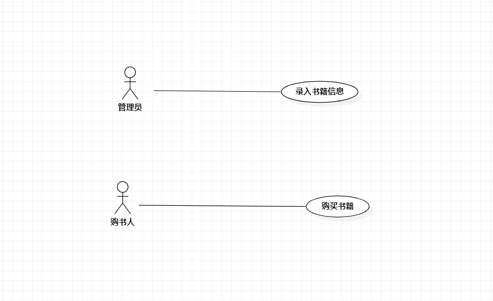

# 实验二：用例建模

## 一、实验内容

1. 细化功能需求。
2. 画出用例图（Use Case Diagram）。
3. 编写用例规约（表格）。

## 二、实验要求

1. 给每一个功能点写一段描述（字数至少60字，3行）。
2. 写清楚使用功能的用户。
3. 说明该功能执行之后产生的结果。
4. 用例规约必填：基本流程（成功执行用例的步骤）；扩展流程（引起用例失败的步骤）。

## 三、实验步骤

1. 确定二手书籍交易系统功能并描述
   - 录入书籍信息：管理员从售书人中获取书籍，成功登录后，点击“录入书籍信息”按钮，将“出售人账号”“出售人姓名”，“出售价格”，“ISDN码”，“作者”，“出版社”信息分别填入相应的文本框中，点击“确定”按钮进行上传，管理员保留书籍。
   - 购买书籍：购书人在登录成功后，直接进入系统主页面，主页面展示出售的书籍，确认要购买的书籍点击“购买”按钮，进入付款页面，点击“确认付款”，付款成功后显示订单码，购书人姓名和出售人姓名，并显示“截图保存”的文字，通过截图向管理员取书。
   - 查询出售情况：售书人登录成功后，点击个人页面，点击“我出售的书籍”，显示我出售的书籍信息以及是否已被购买。
2. 确定使用者
   - 管理员
   - 购书人
   - 售书人
3. 创建usecase（录入书籍信息，购买书籍，查询出售情况）分别于Actor（管理员，购书人，售书人）连接
4. 导出用例图。

## 四、实验结果

### 用例图

  

### 用例规约的编写

1. 表1：录入书籍信息用例规约

   + | 用例编号 | UC01                                            | 备注                 |
     | -------- | :---------------------------------------------- | -------------------- |
     | 用例名称 | 录入书籍信息                                           |                      |
     | 前置条件 | 管理员登录系统                              | *可选*               |
     | 后置条件 |                                                 | *可选*               |
     | 基本流程 | 1. 管理员点击录入书籍信息                        | *用例执行成功的步骤* |
     | ~        | 2. 系统显示“出售人账号”“出售人姓名”，“出售价格”，“ISDN码”，“作者”，“出版社”文本框及输入文本框以及“确定”按钮                        |                      |
     | ~        | 3. 管理员填写完成并点击“确定”按钮              |                      |
     | ~        | 4. 系统生成本书的序号，数据库保存序号和书籍信息      |                      |
     | ~        | 5. 系统显示提交完成文本框      |                      |
     | 扩展流程 | 3.1 管理员书籍信息未全部填写完全，显示未完成信息填写，请继续填写提示框 | *用例执行失败*       |
     | ~        | 3.2 管理员点击“取消”按钮，过程取消，返回主界面      |                      |

2. 表2：购买书籍用例规约

   + | 用例编号 | UC02                              | 备注                 |
     | -------- | :-------------------------------- | -------------------- |
     | 用例名称 | 购买书籍                             |                      |
     | 前置条件 | 购书人登录系统                | *可选*               |
     | 后置条件 |                                   | *可选*               |
     | 基本流程 | 1. 登录完成后，数据库查询所有可销售的书籍，展示到购书主界面    | *用例执行成功的步骤* |
     | ~        | 2. 确认要购买的书籍，点击“购买”按钮，进入付款页面          |                      |
     | ~        | 3. 点击“确认付款”按钮 |
     | ~        | 4. 系统确认用户已付款，书籍信息被更改为已购买，生成订单         |      |
     | ~        | 5. 显示"订单码"，"购书人姓名"和"出售人姓名"的订单信息，并显示“截图保存”的文字            |                      |
     | 扩展流程 | 1.1 系统当前无任何可销售书籍  | *用例执行失败*       |
     | ~        | 3.1 购书人点击“取消付款”按钮，返回主界面  |
     | ~        | 3.2 书籍已经被购买，显示“书籍已被购买”提示框，返回主界面  |

3. 表3：查询出售情况用例规约

   + | 用例编号 | UC03                                                  | 备注                 |
     | -------- | :---------------------------------------------------- | -------------------- |
     | 用例名称 | 查询出售情况                                                  |                      |
     | 前置条件 | 售书人登录系统                                    | *可选*               |
     | 后置条件 |                                                       | *可选*               |
     | 基本流程 | 1. 登录成功后，在主界面点击“个人中心”按钮                        | *用例执行成功的步骤* |
     | ~        | 2. 系统查询该账号下的所有出售书籍            |     
     | ~        | 3. 系统显示改账号下的出售书籍信息以及是否被购买状态            |           
     | 扩展流程 |  2.1 当前账号下无出售书籍，显示“您未出售任何书籍”的文本框，返回主界面             | *用例执行失败*       |
