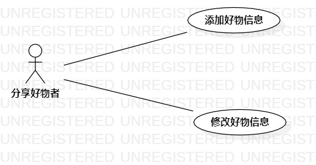

# 实验二：用例建模

## 一、实验目标

1. 确定并完善选题
2. 完成用例建模
3. 完成实验报告

## 二、实验内容

1. 建立选题

2. 用例建模
3. 编写用例规约

## 三、实验步骤

1. 选题并创建Issue，Issue名为：好物推荐软件
2. 确定Use case
   - 添加好物信息
   - 修改好物信息
   - 搜索好物信息
3. 确定actor
   - 分享好物者
   - 购物者
4. 确定Use case与actor之间的关系
5. 使用StarUML完成用例建模
6. 根据用例建模编写用例规约

## 四、实验结果

图1：好物推荐软件的用例图

## 表1：添加好物信息用例规约

| 用例编号 | UC01                                                         |
| -------- | :----------------------------------------------------------- |
| 用例名称 | 添加好物信息                                                 |
| 前置条件 | 分享好物者已经登录                                           |
| 后置条件 | 系统提示添加成功，返回首页                                   |
| 基本流程 | 1.分享好物者点击添加好物按钮                                 |
| ~        | 2.系统显示添加好物信息页面                                   |
| ~        | 3.分享好物者输入名称、推荐理由、好物链接，添加图片，点击添加按钮 |
| ~        | 4.系统检查输入信息符合规范，添加一条好物信息                 |
| ~        | 5.系统提示添加成功，返回首页                                 |
| 扩展流程 | 4.1 系统检查发现无名称                                       |
| ~        | 4.2 系统检查发现无推荐理由                                   |
|          | 4.3 系统检查发现无图片                                       |

## 表2：修改好物信息用例规约

| 用例编号 | UC02                                             |
| -------- | :----------------------------------------------- |
| 用例名称 | 修改好物信息                                     |
| 前置条件 | 1.分享好物者已经登录                             |
| ~        | 2.分享好物者有添加过好物信息                     |
| 后置条件 | 系统提示修改成功，返回首页                       |
| 基本流程 | 1.分享好物者点击自己添加的好物信息相应的修改按钮 |
| ~        | 2.系统显示修改好物信息页面                       |
| ~        | 3.分享好物者修改信息或更换图片，点击修改按钮     |
| ~        | 4.系统检查输入信息符合规范，修改好物信息         |
| ~        | 5.系统提示修改成功，返回首页                     |
| 扩展流程 | 4.1 系统检查发现无名称                           |
| ~        | 4.2 系统检查发现无推荐理由                       |

## 表3：搜索好物信息用例规约

| 用例编号 | UC03                                 |
| -------- | :----------------------------------- |
| 用例名称 | 搜索好物信息                         |
| 后置条件 | 系统显示搜索到的好物信息             |
| 基本流程 | 1.购物者输入搜索关键字，点击搜索按钮 |
| ~        | 2.系统根据关键字搜索到好物信息       |
| ~        | 3.系统显示搜索到的好物信息           |
| 扩展流程 | 2.1 系统根据关键字没有搜索到好物信息 |