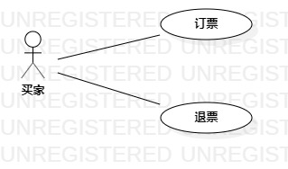

# 实验二：用例建模
## 一 实验目标
1. 给每一个功能点写一段描述（字数至少60字，3行）。
2. 写清楚使用功能的用户。
3. 说明该功能执行之后产生的结果。
4. 用例规约必填：基本流程（成功执行用例的步骤）；扩展流程（引起用例失败的步骤）。

## 二 实验内容
1. 细化功能需求。
2. 画出用例图（Use Case Diagram）。
3. 编写用例规约（表格）。

## 三 实验步骤
1. 画出用例图；
2. 细化功能需求以及填写用例规格

第一个用例：
 | 概念 | 详细信息 |
 | :-----| :----: |
 | 用例编号： | UC_01 |
 | 用例名称 | 订票 | 
 | 用例描述： | 买家需要出行，于是通过本系统在线上选择到达某个目的地的车票，系统会打印出电子车票在个人账户上|
 | 基本流程： | 1. 买家选择起始点，目的地、出发时间，点击“购票”按钮；   2. 系统检查订单信息合格，创建一条订单记录，显示下单成功。  |
 | 扩展流程： | 2.1 系统检查发现购买数量小于0，提示数量不对；  2.2 系统检查发现购买数量大于库存量，提示库存不够；  |
 
第二个用例： 
 |概念 | 详细信息 |
 | :--- | :---: |
 | 用例编号： | UC_02 |
 | 用例名称： | 退票 |
 | 用例描述： | 买家因各种原因，只能放弃已购买且未过期的车票，于是在系统上进行退票，发出退票申请，经系统检查无误后，成功退票。 |
 | 基本流程： | 1. 买家点击退票按钮，选择退票理由，点击确认退票按钮   2. 系统检查车票是否过期，确认未过期，删除此条订单，显示退票成功. |
 | 扩展流程： | 2.1 系统检查发现已超过指定退票限制时间，提示已超过退票时间，不允退票； |
 
## 四 实验结果
  
图：线上车票预定系统
