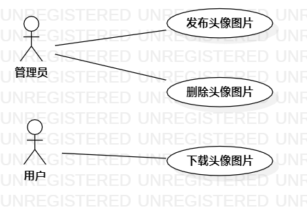

# 实验二：用例建模

## 1.实验目标

1. 学会使用Markdown编写实验报告 
2. 掌握用例的概念和用例建模

## 2.实验内容

1. 提交个人选题到Issues 
2. 用StartUML完成用例建模 
3. 用Markdown完成实验报告

## 3.实验步骤

1. 确定issues：**头像大全app**，功能如下：

   - 管理员发布头像图片

   - 管理员删除头像图片

   - 用户下载头像图片

2. 提交issues，使用StarUML画出相关用例图：

   - 创建“管理员”和“用户”两个参与者

   - 创建三个用例

   - 建立关系Association

3. 编写用例规约

4. 提交用例图和实验报告到github

## 4.实验结果

### 4.1用例图

图一：“头像大全app”用例图

### 4.2用例规约

图片存放在服务器文件系统，图片信息存放在服务器的数据库。

#### 表1：发布头像图片用例规约

| 用例编号 | UC01                                                         | 备注                   |
| -------- | ------------------------------------------------------------ | ---------------------- |
| 用例名称 | 发布头像图片                                                 |                        |
| 前置条件 | 管理员登录到后台系统                                         |                        |
| 后置条件 | 管理员进入头像图片详情页                                     | 显示所有图片和图片信息 |
| 基本流程 | 1. 管理员点击发布头像图片链接；                              | 成功                   |
| ~        | 2. 系统显示发布头像图片页面，加载图片分类数据；              | 分类：艺术风、小清新等 |
| ~        | 3. 管理员选择图片分类信息，点击选择图片按钮；                |                        |
| ~        | 4. 系统显示本地机的选择图片窗口；                            |                        |
| ~        | 5. 管理员确定图片，点击发布按钮；                            | 可以多个图片，去除图片 |
| ~        | 6. 系统检查图片分类信息不为空、图片个数大于零、和图片格式正确； | 格式：png、jpg、jpeg   |
| ~        | 7. 系统保存图片并获取图片地址，保存图片信息（id，分类、图片地址url），提示“发布成功”。 |                        |
| 扩展流程 | 6.1 系统检查图片分类信息为空，提示“图片分类信息不为空”；     | 失败                   |
| ~        | 6.2 系统检查图片个数等于零，提示“图片至少1个”；              | 失败                   |
| ~        | 6.3 系统检查图片个数大于零和图片格式不正确，提示“图片格式错误”。 | 失败                   |

#### 表2：删除头像图片用例规约

| 用例编号 | UC02                                                         | 备注     |
| -------- | ------------------------------------------------------------ | -------- |
| 用例名称 | 删除头像图片                                                 |          |
| 前置条件 | 管理员登录到后台系统                                         |          |
| 后置条件 |                                                              |          |
| 基本流程 | 1. 管理员点击查看头像图片链接；                              | 成功     |
| ~        | 2. 系统显示头像图片详情页，加载所有图片和图片信息；          | 分页显示 |
| ~        | 3. 管理员点击某条图片数据的删除按钮；                        |          |
| ~        | 4. 系统通过id检查图片信息存在，获取图片地址存在；            | 自增id   |
| ~        | 5. 系统通过图片地址删除图片，删除图片信息，提示“图片数据已删除”。 |          |
| 扩展流程 | 4.1 系统检查图片信息不存在，提示“图片数据不存在”；           | 失败     |
| ~        | 4.2 系统检查图片信息存在，获取图片地址不存在，删除图片信息。提示“图片数据已删除”。 | 成功     |

#### 表3：下载头像图片用例规约

| 用例编号 | UC03                                                         | 备注       |
| -------- | ------------------------------------------------------------ | ---------- |
| 用例名称 | 下载头像图片                                                 |            |
| 前置条件 | 用户进入app首页                                              | 不需要登录 |
| 后置条件 |                                                              |            |
| 基本流程 | 1. 用户点击分类按钮；                                        |            |
| ~        | 2. app通过分类查询出图片信息，显示；                         | url显示    |
| ~        | 3. 用户点击某个图片下的下载按钮；                            |            |
| ~        | 4. app通过图片地址获取到图片字节输入流；                     | url        |
| ~        | 5. app将图片字节输入流转化为图片并保存到用户手机相册中，提示“下载成功”。 |            |
| 扩展流程 | 4.1 app通过图片地址获取不到图片字节输入流，提示“抱歉，服务器内部错误”。 | 失败       |