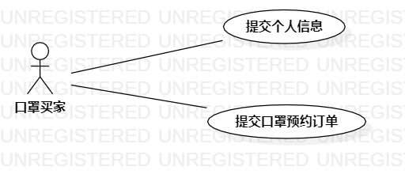

# 实验二

## 一、实验目标

1. 熟悉用Markdown文件编写实验报告；
2. 熟悉用StarUML绘制用例图；
3. 掌握用例规约的编写。

## 二、实验内容

1. 细化选题功能；
2. 使用StarUML绘制用例图；
3. 编写用例规约表格；
4. 编写实验报告。

## 三、实验步骤

1. 细化选题功能：
   - 改“用户”为“口罩买家”；
   - 删除“保存数据库”等啰嗦语句；
   - 删除查询功能。
2. 在StarUML绘制用例图：
   - 打开StarUML，在Model文件夹右键，选择“Add Diagram”，新建“Use Case Diagram”；
   - 创建一个名为“口罩买家”的参与者；
   - 创建两个功能用例，分别为“提交个人信息”和“提交口罩预约订单”；
   - 连接“口罩买家”和两个功能用例。
3. 编写用例规约表格。

## 四、实验结果

    

图1 ：口罩预约小程序的用例图

#### 表1：提交个人信息用例规约

| 用例编号 | UC001                                                        |
| -------- | ------------------------------------------------------------ |
| 用例名称 | 提交个人信息                                                 |
| 前置条件 | 系统获取口罩买家授权的微信openId                             |
| 后置条件 | 系统跳转回小程序首页                                         |
| 基本流程 | 1.口罩买家点击“提交身份信息”链接；                           |
| ~        | 2.系统显示“身份信息”页面；                                   |
| ~        | 3.口罩买家输入“姓名”、“手机号码”、“身份证号”，点击“提交”按钮； |
| ~        | 4.系统检查手机号码和身份证号的填写格式正确，将这三条数据结合openId新增到“用户信息表”中； |
| ~        | 5.系统提示“提交成功”，并跳转回小程序首页。                   |
| 扩展流程 | 4.1 系统检查口罩买家的手机号码格式填写有误，提示“手机号码填写有误”； |
| ~        | 4.2 系统检查口罩买家的身份证号格式填写有误，提示“身份证号填写有误”。 |

#### 表2：提交口罩预约订单用例规约

| 用例编号 | UC002                                                        |
| -------- | ------------------------------------------------------------ |
| 用例名称 | 提交口罩预约订单                                             |
| 前置条件 | 口罩买家已提交个人信息                                       |
| 后置条件 | 系统显示订单信息页面                                         |
| 基本流程 | 1.口罩买家点击“口罩预约”链接；                               |
| ~        | 2.系统显示“口罩预约”页面；                                   |
| ~        | 3.口罩买家选择“预约数量”、“预约门店地址”，点击“预约”按钮；   |
| ~        | 4.系统检查预约数量不超过2包，并且预约的门店有存货，将口罩数量和预约门店地址，结合微信openId，写入“订单表”中，同时减去预约门店的口罩存货数量； |
| ~        | 5.系统提示“预约成功”，并跳转到订单信息页面。                 |
| 扩展流程 | 4.1 系统检查到预约数量超过两包，提示"口罩数量每人仅限2包"；  |
| ~        | 4.2 系统检测预约门店存货数量小于预约的口罩数量，提示“所选门店口罩存货不足”。 |

