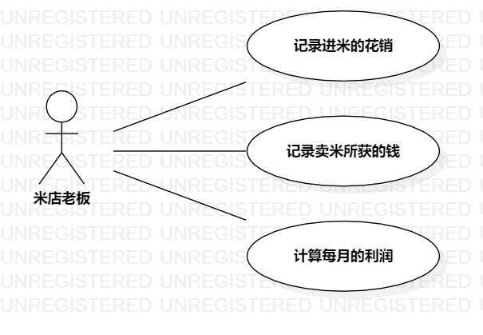

# 实验二：用例建模  

## 一、 实验目标  

1. 使用Markdown编写报告
2. 细化选题
3. 学习使用StarUML用例建模

## 二、 实验内容  

1. 创建用例图
2. 编写实验报告文档
3. 编写用例规约

## 三、 实验步骤  

1. 选题为米铺进卖米系统
2. 根据issues在StarUML上创建用例图（Lab2_UseCaseDiagram）
3. 确定参与者（Actor）:  
      - 米店老板   
4. 确定用例（UserCase）:   
      - 记录进米的花销
      - 记录卖米的收入
      - 计算每月的利润
5. 建立Actor和UserCase之间的联系
6. 绘画用例图（Lab2_UseCaseDiagram）
7. 编写用例规约

## 四、 实验结果  

1. 画图  
  
图1:米铺进卖米系统的用例图

## 表1：记录进米的花销  

用例编号  | UC01 | 备注  
-|:-|-  
用例名称  | 记录进米的花销  |   
前置条件  |  米店老板登录进入米铺系统   | *可选*   
后置条件  | 米店老板进入财务系统     | *可选*   
基本流程  | 1. 米店老板点击录入进货按钮；  |*用例执行成功的步骤*    
~| 2. 系统显示米店进米录入页面；  |   
~| 3. 布庄店主填写米种类的信息、填写米数量的信息、填写米价格的信息，点击录入按钮；  |   
~| 4. 系统计算花销，保存花销和日期信息；  |   
~| 5. 系统显示花费页面。  |    

## 表2：记录卖米的收入

用例编号  | UC02 | 备注  
-|:-|-  
用例名称  | 记录卖米的收入  |   
前置条件  |  米店老板进入财务系统   | *可选*   
后置条件  |    | *可选*   
基本流程  | 1. 米店老板点击卖米按钮；  |*用例执行成功的步骤*    
~| 2. 系统显示每日收入页面；  |   
~| 3. 米店老板输入一天卖米的袋数及种类的数量；  |   
~| 4. 系统计算每天的收入，并将日期与收入信息一并保存；  |   
~| 5. 系统显示完成页面。  |  
  

## 表3：计算每月的利润 

用例编号  | UC03 | 备注  
-|:-|-  
用例名称  | 计算每月的利润  |   
前置条件  |  米店老板进入财务系统   | *可选*   
后置条件  |     | *可选*   
基本流程  | 1. 布庄店主点击计算每月利润按钮；  |*用例执行成功的步骤*    
~| 2. 系统显示选择几年几月的利润页面；  |   
~| 3. 米店老板输入具体的年与月；  |   
~| 4. 系统将那个月的收入与花销进行计算； |   
~| 5. 系统显示结果。  |  
扩展流程  | 4.1 系统检查发现输入的月份尚未结束，显示“无法进行计算，无当月全部信息。””。  |*用例执行失败* 
