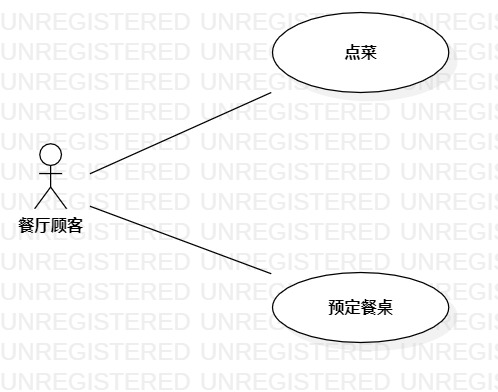

# 实验二：用例建模

## 1.实验目标

- 理解用例的概念
- 使用用例建模

## 2.实验内容

- 对应自己的选题使用用例建模

## 3.实验步骤

- 创建一个名为餐厅顾客的角色
- 创建三个实例，分别为浏览菜单，选择菜品，查询订单
- 用直线连接餐厅顾客和三个用例
- 写出浏览菜单，选择菜品，查询订单的三个用例规约

## 4.实验结果

 
 
 图1.客户点菜程序的用例图

## 表1：浏览菜单用例规约  

用例编号  | 01 | 备注  
-|:-|-  
用例名称  | 浏览菜单  |   
前置条件  |   餐厅顾客进入点菜程序主界面   | *可选*   
后置条件  | 餐厅顾客看到菜单信息     | *可选*   
基本流程  | 1. 餐厅顾客点击浏览菜单链接；  |*用例执行成功的步骤*    
~| 2. 系统查询菜单信息；  |     
~| 3.系统显示菜单信息到浏览菜单界面；  |  
扩展流程  | 4.1 系统找不到菜单信息，提示【系统错误，请返回主界面】  |*用例执行失败*  

## 表2：选择菜品用例规约  

用例编号  | 02 | 备注  
-|:-|-  
用例名称  | 选择菜品  |   
前置条件  |   餐厅顾客进入浏览菜单界面   | *可选*   
后置条件  |      | *可选*   
基本流程  | 1.餐厅顾客点击想要菜品后的+号，再点击提交按钮  |*用例执行成功的步骤*    
~| 2.系统保存订单信息，提示【已下单，单号:xx】  |   
扩展流程  | 2.1 系统订单保存失败，提示【下单失败】  |*用例执行失败*    

## 表3：查询订单用例规约  

用例编号  | 03 | 备注  
-|:-|-  
用例名称  | 查询订单  |   
前置条件  |   餐厅顾客进入点菜程序主界面   | *可选*   
后置条件  |   餐厅顾客看到自己的订单信息   | *可选*   
基本流程  | 1.餐厅顾客点击查询订单链接  |*用例执行成功的步骤*    
~| 2.系统显示查询订单界面  |   
~| 3.餐厅顾客输入单号，点击查询按钮   |   
~| 4.系统查询到匹配单号的订单信息  |   
~| 5. 系统显示订单信息到界面  |  
扩展流程  | 4.1系统查询不到订单，提示【订单不存在】   |*用例执行失败*    

