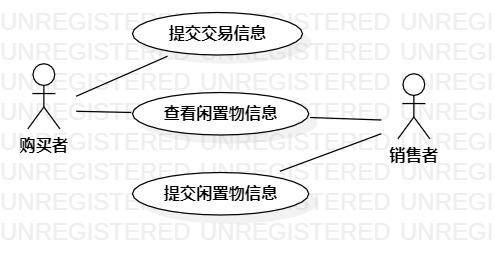

# 实验二

## 一、实验目标

1. Markdown编写文档
2. 确认细化选题
3. 熟悉StarUML建模操作

## 二、实验内容

1. 细化选题功能
2. 创建闲置物出售平台用例图
3. 编写用例规范

## 三、实验步骤

1. 确定选题：#390 闲置物出售平台
2. 完善功能描述:  
(1) 用户能查看自己和别人的个人信息（包括姓名，性别，年龄，信誉值，交易次数，使用该平台的时间）  
(2) 销售者能提交自己的闲置物信息（包括闲置物名称，商品描述，价格，交易手段等等）  
(3) 购买者能提交闲置物的交易信息

3. 画用例图：  
(1) 参与者： 
- 销售者
- 购买者

(2) 用例：
- 查看用户信息
- 提交闲置物信息
- 查看闲置物信息
- 提交交易信息

## 四、实验结果

1. 绘制用例图

  
图1. 闲置物出售平台用例图

## 表1：查看用户信息用例规约  

用例编号  | u01 | 备注  
-|:-|-  
用例名称  | 查看用户信息  |   
前置条件  | 用户登录成功  | 用户包括购买者和销售者
后置条件  | 进入用户个人信息显示页面  | *可选*   
基本流程  | 1. 点击用户头像下的“详细信息”按钮 |*用例执行成功的步骤*    
~| 2. 进入用户个人信息显示页面 |
扩展流程  |   |*用例执行失败*    

## 表2：提交闲置物信息用例规约  

用例编号  | v01 | 备注  
-|:-|-  
用例名称  | 提交闲置物信息  |   
前置条件  | 销售者登录成功  | *可选*   
后置条件  | 进入个人闲置物页面 | *可选*   
基本流程  | 1. 销售者点击新建闲置物按钮  |*用例执行成功的步骤*    
~| 2. 进入闲置物创建示页面 |
~| 3. 销售者输入闲置物的名称，商品描述，价格，图片，交易手段等等信息，点击完成按钮 |
~| 4. 系统自动审核是否有违规词语，价格是否在值域内 |
~| 5. 提示闲置物创建成功消息，跳回个人闲置物页面 |
扩展流程  | 4.1 有违规词语，显示"检测到有违规词语"消息框 |*用例执行失败* 
 | 4.2 价格不合理时，显示"请输入正确价格"消息框 |*用例执行失败* 

## 表3：查看闲置物信息用例规约  

用例编号  | v02 | 备注  
-|:-|-  
用例名称  | 查看闲置物信息  |   
前置条件  | 用户登录成功  | 用户包括购买者和销售者 
后置条件  | 进入闲置物显示页面 | *可选*   
基本流程  | 1. 在搜索栏中录入关键词，点击搜索按钮 |*用例执行成功的步骤*   
~| 2. 系统在闲置物显示页面上显示相关的闲置物 |
~| 3. 点击任一闲置物图片，跳转到闲置物详细信息页面 |
扩展流程  | 2.1 没有符合条件得闲置物时，页面显示"找不到符合条件的商品"消息 |*用例执行失败*  

## 表4：提交交易信息用例规约  

用例编号  | v03 | 备注  
-|:-|-  
用例名称  | 提交交易信息  |   
前置条件  | 购买者登录成功  | *可选*   
后置条件  | 进入闲置物详细信息页面 | *可选*   
基本流程  | 1. 点击“购买”按钮 |*用例执行成功的步骤*    
~| 2. 跳转到购物信息确认页面 |
~| 3. 确认按钮，交易完成 |
扩展流程  | 3.1 购买者点击"取消"按钮，交易失败，跳回闲置物详细信息页面 |*用例执行失败*  
