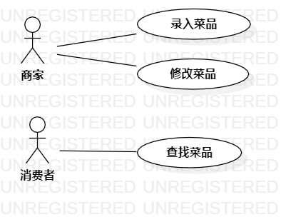

# 实验二：用例建模

### 一、实验目标
    1.确立自己的选题
    2.根据自己的选题,完成功能介绍
    3.根据自己的题目画出该题目的用例图
    4.完成用例规约
    

### 二、实验内容
    1.在issue里提交自己的选题和功能介绍
    2.我的题目是#464 今日食咗未点菜系统，功能是：
        1）商家录入菜品
        2）商家修改菜品
        3）消费者查找菜品
    3.根据自己的选题，找出参与者与用例，并画出用例图
       
 ### 三、实验步骤
     1.看选题，找出我的选题中的两个参与者：商家和消费者。
     2.再根据选题的功能，写出三个用例： 1）商家录入菜品 2）商家修改菜品 3）消费者查找菜品
     3.建立参与者与用例之间的联系（Association）
     4.写出三个用例的用例规约，如下表表1、表2、表3所示

### 四、实验结果

  
  
    
  
  图1.今日食咗未点菜系统的用例图

## 表1：录入菜品用例规约  

用例编号  | UC01 | 录入菜品  
-|:-|-  
用例名称  | 录入菜品  |   
前置条件  | 商家登录进入点菜系统     |  
后置条件  |      |   
基本流程  | 1.商家点击录入菜品按钮；  |  
~| 2.系统显示录入页面；  |   
~| 3.商家添加菜品名称和价格和图片，点击完成按钮；   |   
~| 4.系统查询菜品信息，检查未存在相同菜品名称且菜名不为空，保存菜品信息；   |   
~| 5.系统显示菜品页面。   |  
扩展流程  | 4.1 系统检查菜名为空，提示“菜品名称不能为空” ；  |    
~| 4.2系统检查菜品名称已经存在，提示“此菜已存在”。 |  

## 表2：修改菜品用例规约  

用例编号  | UC02 | 修改菜品  
-|:-|-  
用例名称  | 修改菜品  |   
前置条件  | 商家登录进入点菜系统     |  
后置条件  |      |    
基本流程  | 1.商家点击修改菜品按钮；  |
~| 2.系统显示修改页面；  |   
~| 3.商家修改菜品名称或价格或图片，点击完成按钮；   |   
~| 4.系统查询菜品信息，检查未存在相同菜品名称且菜名不为空，保存菜品信息；  |   
~| 5.系统显示菜品页面。   |  
扩展流程  | 4.1 系统检查菜名为空，提示“菜品名称不能为空” ；  |   
~| 4.2系统检查菜品名称已经存在，提示“此菜已存在”。 |  

## 表3：查找菜品用例规约  

用例编号  | UC03 | 查找菜品  
-|:-|-  
用例名称  | 查找菜品    |   
前置条件  | 消费者登录进入点菜系统     |  
后置条件  |      |    
基本流程  | 1.消费者点击查询菜品按钮；  |
~| 2.系统显示查询页面；  |   
~| 3.消费者输入菜品名称，点击完成按钮；   |   
~| 4.系统检查菜品名称不为空，查询菜品信息；  |   
~| 5.系统显示菜品信息页面。   |  
扩展流程  | 4.1 系统检查菜名为空，提示“菜品名称不能为空” 。  | 
  
 

