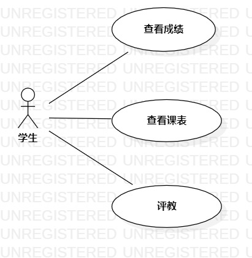

# 实验二

## 一、实验目标
1. 学会如何使用Markdown编写实验报告；
2. 学会如何分析一个系统的功能性需求，并实现用例建模。

## 二、实验内容
- 确定选题，并分析其功能性需求（2~3个）；
- 使用StartUML软件绘制用例建模图；
- 将用例建模图导出，并添加到实验报告中；
- 使用MarkDown编写实验报告，并提交到实验网站上。

## 三、实验步骤
- 确定建模选题（图书馆座位管理系统），并分析其功能性需求（2~3个）；
- 根据上一步分析得到的功能性需求，使用StartUML软件绘制相应的用例建模图；
- 导出用例建模图到本地计算机上；
- 打开Git Bash，并跳转到实验路径下（F:\uml-modeling-2020\students）；
- 输入git pull命令，同步实验网站的数据到本地；
- 在Git Bash使用相关命令将之前导出的用例建模图（UseCaseDiagram1.jpg）添加到网站的个人库上；
- 在个人库上的本人学号目录下创建实验报告文件（lab2.md）；
- 编写实验报告（包含实验目标、实验内容、实验步骤、实验结果）；
- 将实验报告（lab2.md）提交到个人库上，并查看实验结果是否正确；
- 检查正确后，将实验报告提交到主库上，并再次检查结果；
- 检查无误后，在Git Bash上输入git pull命令，将刚才在实验网站上做的修改全部同步到本地计算机上；
- 实验结束。

## 四、实验结果
