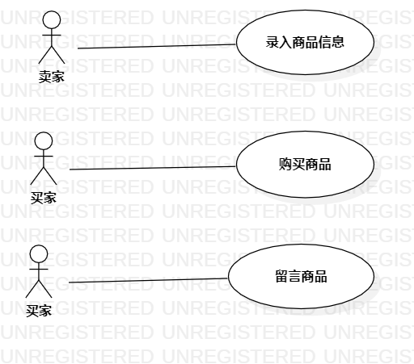

# 实验二

## 一、实验目标

&emsp;学习掌握用例建模知识

## 二、实验内容

1. UML建模选题
2. 绘制用例图
3. 编写用例规约

## 三、实验步骤

1. UML建模选题为校园二手交易网站
2. 根据选题功能绘制用例图
3. 确定用例：
- 录入商品信息
- 购买商品
- 评论商品
4. 确定参与者：
- 卖家
- 买家
5. 联系参与者和用例
6. 编写用例规约

## 四、实验结果

图1.校园二手交易平台用例图

## 表1：录入商品信息用例规约  

用例编号  | UC01 | 备注  
-|:-|-  
用例名称  | 录入商品信息  |   
前置条件  |卖家成功登录校园二手交易网站      |  
后置条件  |卖家进入对应商品类别板块的商品列表     |   
基本流程  | 1. 卖家进入个人中心页面  | 
~| 2. 系统显示个人中心页面  |   
~| 3. 卖家在个人中心页面点击出售按钮  |   
~| 4. 系统显示信息录入页面  |   
~| 5. 卖家输入商品信息后点击提交按钮 |  
~| 6. 系统检查必填信息填写完全，保存商品信息 |
~| 7. 商品根据时间顺序显示在对应类别板块的商品列表中|
~| 7. 系统显示对应商品类别板块的商品列表 |
扩展流程  | 4. 系统检查卖家在卖家黑名单内 |    
~| 6. 系统检查商品必填信息为空   |  

## 表2：购买商品用例规约  

用例编号  | UC02 | 备注  
-|:-|-  
用例名称  | 购买商品  |   
前置条件  | 买家登录校园二手交易网站   |
后置条件  | 买家进入支付成功页面   |   
基本流程  | 1. 买家在商品详情页点击购买按钮   |  
~| 2. 系统显示订单支付页面 |   
~| 3. 系统查询并显示用户保存的收货信息  |   
~| 4. 买家检查修改订单信后点击提交按钮 |    
~| 5. 系统保存订单信息 |
~| 6. 系统调用第三方支付接口 |  使用支付宝支付
~| 7. 买家在第三方支付窗口完成支付 |
~| 8. 系统检查支付结果为支付成功，保存支付状态|
~| 9. 系统显示支付成功页面  |
扩展流程  | 2. 买家未登录   |*用例执行失败*    
~| 5. 系统检查收获信息不完整  | 完整收货信息包括收信人名称、联系方式、收货地址
~| 8.1 买家取消支付支付 |
~| 8.2 买家支付失败 | 
