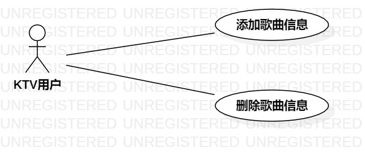

# 实验二：用例建模

## 一. 实验目标

1. 使用Markdown写报告
2. 选题并用例建模

## 二. 实验内容

1. Markdown修改实验一报告
2. 创建用例图
3. 编写实验报告

## 三. 实验步骤

1. 建模选题
2. 功能需求：(1) 新增歌曲信息；(2) 删除歌曲信息；
3. 创建用例图
4. 添加KTV用户和两个用例
5. 建立Association
6. 编写用例规约

## 四. 实验结果

图1：KTV点歌系统用例图

## 表1：新增用例规约  

用例编号  | UC01 | 备注  
-|:-|-  
用例名称  | 新增  |   
前置条件  |      | *可选*   
后置条件  | 歌曲添加到已选歌曲中     | *可选*   
基本流程  | 1. 用户点击添加歌曲按钮；  |*用例执行成功的步骤*    
~| 2. 系统显示输入页面；  |   
~| 3. 用户输入歌曲名称或歌星名字，点击搜索；  |   
~| 4. 系统查询搜索信息，检查歌曲或歌星是否存在；  |   
~| 5. 系统显示所有相关歌曲或歌星信息；  |  
~| 6. 用户点击添加到已选歌曲；  |
~| 7. 系统将歌曲保存到已选歌曲中；  |
扩展流程  | 4.1 系统检查发现歌曲或歌星不存在；  |*用例执行失败*    

## 表2：删除用例规约  

用例编号  | UC02 | 备注  
-|:-|-  
用例名称  | 删除  |   
前置条件  | 已选歌曲中有歌曲     | *可选*   
后置条件  | 歌曲从已选中移除     | *可选*   
基本流程  | 1. 用户点击已选歌曲；  |*用例执行成功的步骤*    
~| 2. 系统显示已选歌曲页面；  |   
~| 3. 用户选择要删除的歌曲，点击删除；  |  
~| 4. 系统检查歌曲是否存在列表中，删除所选歌曲；  | 
~| 5. 系统显示删除成功并重新显示已选歌曲；  |   
扩展流程  | 4.1 系统检查发现歌曲不在列表；  |*用例执行失败*    

