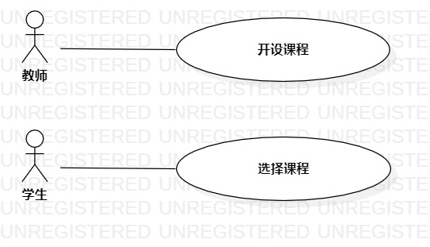

# 实验二：用例建模

## 1.实验目标

- 1.使用Markdown编写报告。
- 2.细化系统选题。
- 3.学习编写用例规约（表格）
- 4.学习使用StarUML用例建模

## 2.实验内容
- 1.根据选题创建用例模型。
- 2.编写用例规约。
- 3.编写实验报告。

## 3.实验步骤
+ 1.确定选题为教务选课管理系统
+ 2.发布选题到issues
+ 3.在StarUML上新建用例图
+ 4.添加用例：
	- 录入课程信息，开设课程
	- 检索课程信息，选择课程
+ 5.添加用例参与者：
	- 学生
	- 老师
+ 6.建立用例与用例参与者的联系
+ 7.导出用例图（UseCaseDiagram1.jpg）
+ 8.编写用例规约

## 4.实验结果
+ 用例图：
  

+ 用例规约：
## 表1：开设课程用例规约  

用例编号  | UC01 | 备注  
-|:-|-  
用例名称  | 开设课程  |   
前置条件  | 教师登陆选课管理系统开课主页     | *可选*   
后置条件  |      | *可选*   
基本流程  | 1. 教师点击添加课程按钮；  |*用例执行成功的步骤*    
~| 2. 系统展示课程信息录入页面；  |   
~| 3. 教师输入课程信息，点击开课按钮；  |   
~| 4. 系统查询课程信息，检查未存在相同课程，保存课程信息；  |   
~| 5. 系统显示开课成功，返回开课主页。  |  
扩展流程  | 4.1 系统检查存在相同课程，**提示“课程存在，不可重复”**；  |*用例执行失败* 
 ~| 4.2 系统返回开课主页。  |
  
## 表1：选择课程用例规约 
用例编号  | UC02 | 备注  
-|:-|-  
用例名称  | 选择课程  |   
前置条件  | 学生登陆选课管理系统选课主页     | *可选*   
后置条件  |      | *可选*   
基本流程  | 1. 学生输入课程号，点击搜索课程按钮；  |*用例执行成功的步骤*    
~| 2. 系统展示匹配课程信息页面；  |   
~| 3. 学生点击课程信息链接，查看课程信息；  |   
~| 4. 学生确认信息，点击选课；  |   
~| 5. 系统检查学生已选课程，检查未存在时间冲突课程，保存选课信息。  |  
~| 6. 系统提示选课成功，返回选课主页。  |   
扩展流程  | 2.1 系统无法匹配课程，**提示“课程不存在，重新检索”**；  |*用例执行失败*  
~| 2.2 系统返回选课主页。  |  
~| 5.1 系统检查存在时间冲突，**提示“课程时间冲突，无法选课”**。  |
~| 5.2 系统返回选课主页。  |
