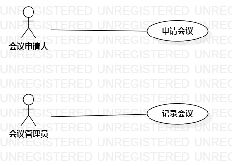

# 实验二：用例建模

## 1. 实验目标

1. 熟悉github使用
2. 理解UML概念
3. 学会StarUML画用例图
4. 学习编写用例规范

## 2. 实验内容

1. 确定选题
2. 画用例图
3. 编写用例规范

## 3. 实验步骤

1. 确定选题

　会议管理系统 功能：
- 申请会议（会议室、计算机、投影仪等）
- 记录会议（记录会议当天时间物资等，编写会议公文）
2. StarUML画用例图
   - 添加Actor:会议申请人、会议管理员
   - 添加UseCase：申请会议、记录会议
   - 建立Actor与UseCase联系
3. 编写用例规范

## 4. 实验结果

图1：会议管理系统用例图

### 表1：申请会议用例规约  

用例编号  | UC01 | 备注  
-|:-|-  
用例名称  | 申请会议  |   
前置条件  |   会议申请人登录进入会议管理系统；   | *可选*   
后置条件  |      | *可选*   
基本流程  | 1.会议申请人点击申请会议按钮；  |*用例执行成功的步骤*    
~| 2.系统显示会议申请界面；  |     
~| 3.会议申请人选择申请开会时间、物资信息，点击申请按钮；   |   
~| 4.系统查询物资信息，比较申请物资数量小于空余物资数量；   |  
~| 5.系统查询会议资源信息，检查不存在开会时间相冲，保存申请信息；   |
~| 6.系统提示“申请成功”；   |
扩展流程  | 4.1系统查询物资信息，比较申请物资数量大于空余物资数量，提示“物资不充足，申请失败！”；   |*用例执行失败*    
~| 5.1系统查询会议资源信息，检查存在开会时间相冲，提示“开会时间相冲，申请失败！”；   |  

### 表2：记录会议用例规约  

用例编号  | UC02 | 备注  
-|:-|-  
用例名称  | 记录会议  |   
前置条件  |   会议管理员登录进入会议管理系统；   | *可选*   
后置条件  |      | *可选*   
基本流程  | 1.会议管理员点击记录会议按钮；  |*用例执行成功的步骤*      
~| 2.系统显示会议记录页面；   |   
~| 3.会议管理员输入当天会议纪要信息，填写会议公文；   |   
~| 4.会议管理员点击记录提交按钮；  | 
~| 5.系统查询记录信息，检查会议纪要信息与申请信息相匹配，保存记录信息；   |
~| 6.系统提示“会议记录保存成功”；   |
扩展流程  | 5.1系统查询记录信息，检查记录信息与申请信息不匹配；   |*用例执行失败*    
~| 5.2系统提示“信息不匹配，记录保存失败”；  |  
